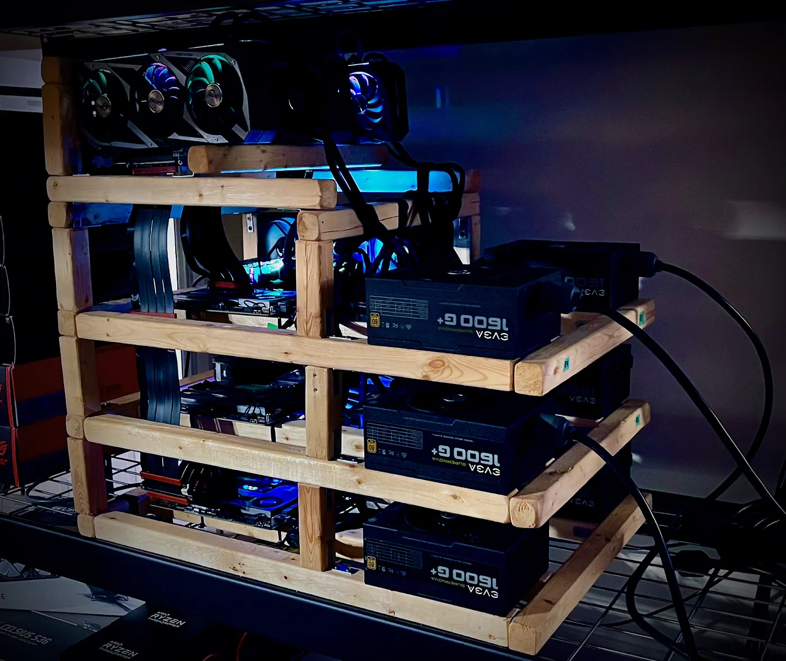

# Kartaverse 6

> The free open-source Cinematic XR solution for the rest of us.
>
> Enjoy!
>

Welcome to the development repo for Valkyrie Engine™ — The new [Kartaverse 6](https://github.com/kartaverse) hybrid volumetric renderer for pixel-streaming XR experiences without limits.

The "Kartaverse Cloud" reboot is planned for Dec 24, 2024.

If you'd like to, you can follow along at home with your own DIY prototype "Sprucetron" XPU rendering appliance... that is built with open-source software at the core, off-the-shelf parts, and a rugged spruce frame.

Valkyrie Engine™ ships with LuaJIT scripting support enabled by default since it's awesome and I wouldn't want to leave home without it. 🤘

