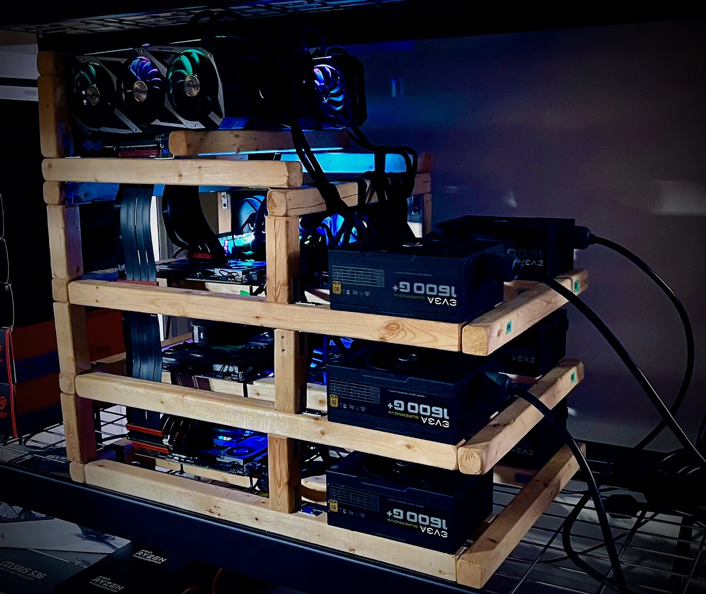

<!-- _coverpage.md -->

# Valkyrie Engine™

> This site allows you to follow the development of the new [Kartaverse 6](https://github.com/kartaverse) hybrid volumetric renderer for pixel-streaming XR experiences without limits.

This is a self-funded R&D project that is a decade in the making. The "Kartaverse Cloud" reboot is planned for Dec 24, 2024. 

If you'd like to, you can follow along at home with your own DIY prototype "Sprucetron" XPU rendering appliance... that is built with open-source software at the core, off-the-shelf parts, and a rugged spruce frame. And of course, Valkyrie Engine™ ships with [LuaJIT](https://luajit.org/luajit.html) scripting support enabled by default since it's awesome and I wouldn't want to leave home without it. 🤘

