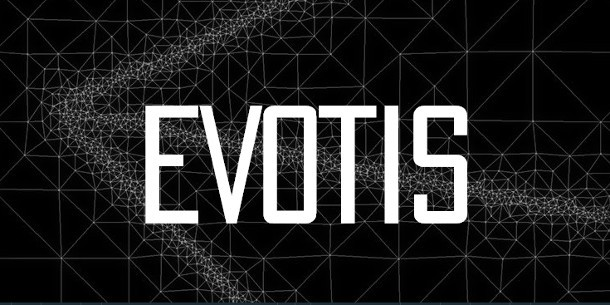

# Evotis Sample-Level Compositing

As an indie software developer, I just scored the literally rare opportunity of a lifetime to do something truly transformative for XR experiences, visual effects, and post-production technology. I got access to become an authorized [GoGhost Evotis](https://www.linkedin.com/company/go-ghost-llc/posts/?feedView=all) licensed 3rd party solutions developer. Nice. 🎉🥳

This gives me permission to work with a collection of unique patented IP for the purpose of creating new DCC (Digital Content Creation) software integration plugins, to build out an end-to-end connected ecosystem for digital artists.

The core technology is called GoGhost Evotis sample level compositing. You likely haven't heard of the core concepts yet, if you aren't in the visual effects sector using 3D animation software and pathtracer based production renderers daily.

GoGhost Evotis takes image workflows into the sub-pixel domain.

Evotis works with raytracing based "ray samples" to allow compositing and image post-processing to be done sub-pixel on the raw stochastic sample data that is generated by a production renderer before anti-aliasing happens, and the raytraced image information is "quantitized" to the final fixed RGB pixel grid. 

In a 3D graphics raytracing workflow, this ray sample information is called non-uniform sample level data. It has a ton of unique properties, that are rarely used once an image is saved into a graphics "framebuffer" and then written to disk. 

It is my professional view that non-uniform image compositing approaches, when fully adopted as an industry, has the capacity to make industry leading VFX technologies like DeepEXR, Cryptomatte, and Gaussian Raytracing all into legacy EOL (End of Life) approaches suitable for the "trash bin" of computer graphics history. The changes that Evotis-like tools unlock for visual artists is profound to say the least, and for the production of Apple Vision Pro and Meta Quest HMD focused spatial video it is even more amazing.

Here is a 2016 era article that discusses the groundbreaking GoGhost Evotis concepts:  
[CG Channel | Go Ghost unveils first ‘sub pixel sample compositor’](https://www.cgchannel.com/2016/06/go-ghost-unveils-first-sub-pixel-sample-compositor/)

## Kartaverse X GoGhost Evotis

What I received yesterday, was that I got a patent access contract finalized and signed that unlocks the right, for me as a 3rd party tool maker/pipeline technical director, to commence the advanced R&D needed in West Dover, Nova Scotia, Canada to build out new software technology using these core GoGhost Evotis patents (that are internationally registered).

Going with an end-to-end sample level approach to image processing has the exciting capacity to change how 6DoF XR content is processed, rendered, composited, edited, and pixel streamed to HMDs.

Non-uniform sample level data also has underpinnings that allow for very strong image encryption that can allow for better-than-bank-level security to be enforced for imaging workflows. This is great for spatial compute/remote sensing use cases in the digital twin space, and for Hollywood level VFX studios who need to protect image-based production assets in post-production, prior to a movie's release.

With Evotis, an end-user can optionally apply a custom signing key certificate to scramble/unscramble the raw raytracing rendered "ray origin" and "ray direction" data which exists in the Evotis software ecosystem as unstructured non-uniform ray sample level information. The Evotis cryptography process makes the image data functionally useless, throughout all stages of a full post-production pipeline, if accessed without the decryption key, as it otherwise makes imagery appear as randomized noise without meaning or intent, or even a coordinate system.

My first port of call for GoGhost Evotis tech integration plugins, is to make it possible to add these types of workflows via a plugin API to my Kartaverse toolset via implementations that will exist for BMD Resolve/Fusion, SideFX Houdini, and Assimilate Scratch/LiveFX.

The end goal of me accessing Evotis sample level technology IP, is that Kartaverse 6 (ETA Christmas 2024) will include an XR pixel streaming server technology called Kartaverse Valkyrie that supports the creation of high-fidelity XR experience creation without limits.

When an end-user decides to add an Evotis integration plugin to their copy of Kartaverse, one unlocks new ways of working with imagery that supports true resolution independence. Exciting!

I for one, am amazed by the sheer potential of these Evotis-powered image generation techniques. In the years ahead, I look forward to getting these workflows supported broadly across leading content creation tools used in the media sector, and in "digital twin" like uses cases for BIM/Survey/GIS industry.

My view is that the future of image creation is going to be neat, and it will inevitably involve non-uniform sample level workflows. People just haven't realized that these concepts are the natural path of evolution needed for artists to unlock next-gen composting and image processing potential. Anything else is ignoring a large world of opportunity that we already have the compute hardware capable to adopt. These software driven techniques can run in real-time on just about everyone's existing mobile, tablet, laptop and desktop systems.
